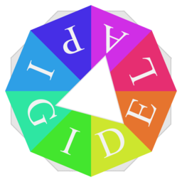

# DigitalPalette

DigitalPalette is a free software for generating harmonious colors from color wheel and local images.

# Version
2.2.7 (develop)

# Author
Eigenmiao

# Copyright
Copyright © 2019-2020. All Rights Reserved.

# License
DigitalPalette is a free software, which is distributed in the hope that it will be useful, but **without any warranty**. You can redistribute it and/or modify it under the terms of the GNU General Public License as published by the Free Software Foundation. See the GNU General Public License for more details.

# Updates
* 2020.02.28 (v2.2.5-pre): Release the preview version (2.2.5) of DigitalPalette.
* 2020.04.08 (v2.2.6-dev): Modify langs.
* 2020.04.25 (v2.2.7-dev): Repair number input failure.
