# DigitalPalette

DigitalPalette 是免费开源软件, 您可以使用它创建一组符合一定色彩调和规则的颜色, 并将其应用到您的创作中.

# 版本
1.0.30 (开发版)

# 安装方法
## 下载
[Windows (32 bit) 安装程序 (推荐)](Link)  
[Windows (64 bit) 安装程序](Link)  
[Windows (32 bit) 压缩包](Link)  
[Windows (64 bit) 压缩包](Link)  

## 安装
1. 双击打开下载的安装程序, 点击 "下一步".  
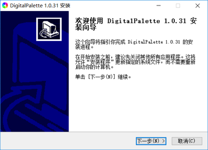

2. 阅读[许可协议](../LICENSE). 若您同意则勾选 "我接受许可协议", 点击 "下一步".  
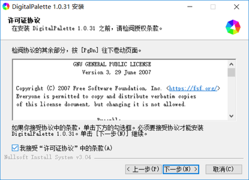

3. 选择安装路径, 点击 "安装" 开始安装.  
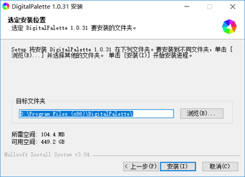

4. 点击 "完成" 结束安装, 运行 DigitalPalette.  
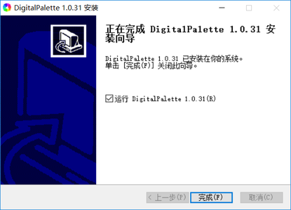

# 使用方法
## 更改语言
目前我们仅提供中文和英文翻译. 您可以通过 PyQt5 自带工具生成其它语言的翻译文件, 并将其放入 language 文件夹中. 随后您可以遵循以下步骤将界面语言更改为其它语言:  
1. 点击菜单栏中的 "编辑", 选择 "设置", 打开设置对话框.  
2. 在 "界面" 选项卡中点击 "语言" 旁的下拉菜单, 选择目标语言, 然后点击 "OK" 即可更改当前界面的语言.  
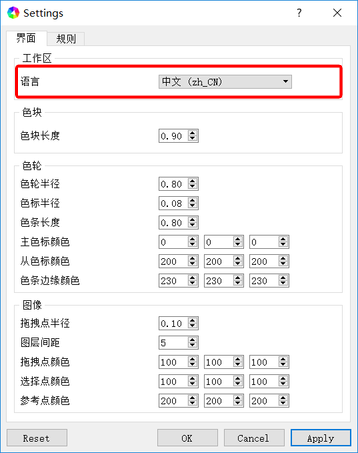

## 界面布局
DigitalPalette 的界面布局如下图所示. 其中:  
* 红色框是标题栏, 包含了软件名称 (DigitalPalette) 和当前版本.
* 蓝色框是菜单栏, 包含了文件**导入** ("文件 -> 导入") 与**导出** ("文件 -> 导出"), **退出**软件 ("文件 -> 退出"), 从色轮**创建** ("编辑 -> 创建") 及从图片**提取** ("编辑 -> 提取") 一组颜色, **设置**软件首选项 ("编辑 -> 设置")等操作.
* 橙色框是选项栏, 包含了一系列的色彩调和规则.
* 紫色框是工具栏, 包含了一些常用操作以及色彩模式的调整.
* 绿色框是工作区, 我们可以通过拖拽或者点选等方式创建或者选取一组颜色.
* 黄色框是结果区, 可以实时查看我们选取的颜色组的信息, 如颜色的**十六进制代码**, **RGB** 数值以及 **HSV** 数值等.
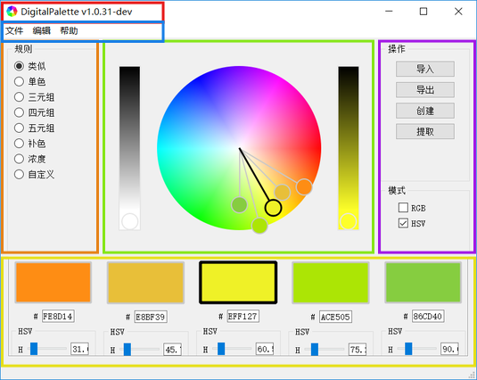

## 从色轮创建一组颜色
DigitalPalette 的工作区中**色轮**上有五个环形颜色标志 (称为**色标**), 分别对应于结果区中的五个**色块**. (中间的色块对应的颜色决定着主色调.) 黑色边框标识出来的色标 (称为**主色标**) 是当前选中的颜色. 您可以通过在色轮上拖动色标或者点击色轮上的任意位置改变主色标对应的颜色, 也可以通过双击色块或者输入十六进制代码, 调节 RGB 或 HSV 滑动条等方式来精准控制其颜色. 与此同时, 色轮上其他色标 (称为**从色标**) 也将跟随主色标的移动而发生变化. 颜色的生成与变化规则由色彩**调和规则**决定. 以下将给出八种调和规则的说明和示例.

## 调和规则
1. **类似** (默认)  
创建一组色调等间距分布的色彩. 间距越近, 色彩越类似.  
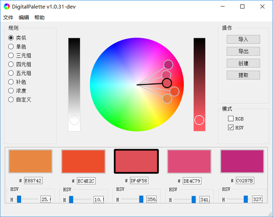

2. **单色**  
创建一组相同色调, 不同饱和度和明度的色彩.  
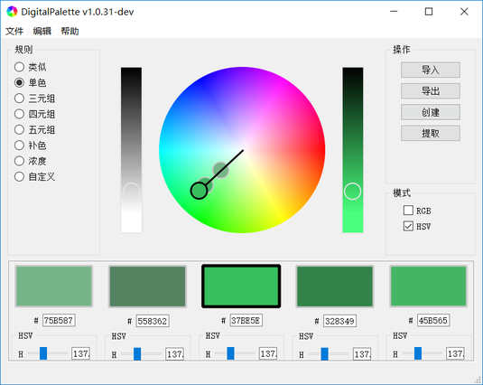

3. **三元组**  
创建一组色调三等分的色彩.  
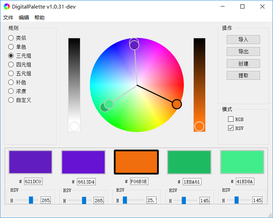

4. **四元组**  
创建一组两两互补的色彩.  
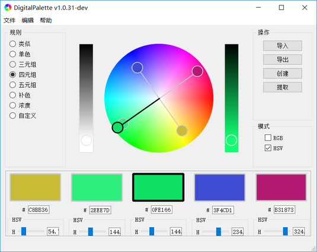

5. **五元组**  
创建一组色调五等分的色彩.  
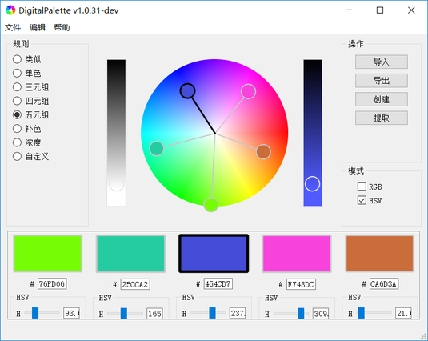

6. **补色**  
创建一组互补色彩.  
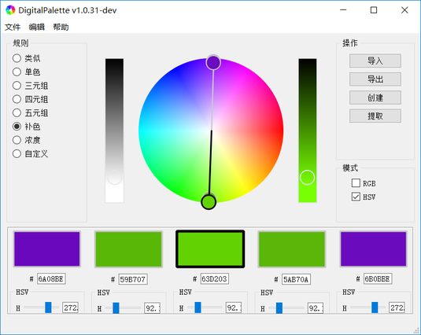

7. **浓度**  
创建一组色调和饱和度相同, 仅有明度变化的色彩.  
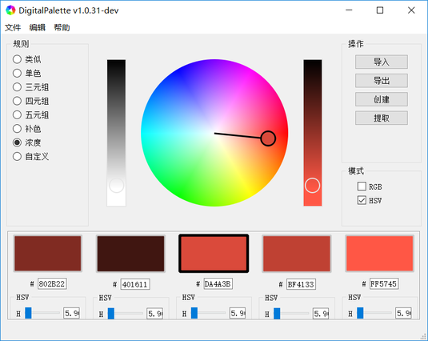

8. **自定义**  
创建一组颜色任意变化的色彩.  
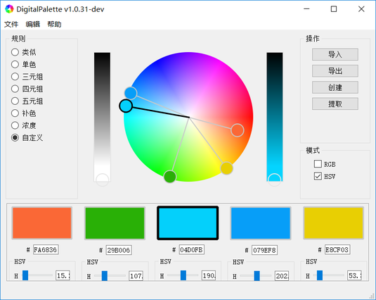

## 导出色彩
当您配好一组色彩后, 您可以将色彩数据导出并保存为可读写文件, 以便后续分析处理以及使用. 步骤如下:  
1. 点击工具栏中的 "导出" 按钮, 或者点击菜单栏中 "编辑 -> 导出", 弹出文件对话框.  
2. 更改导出路径, 文件名和文件类型, 点击保存即可.

## 导出数据格式
目前 DigitalPalette 支持导出为以下格式的数据:
1. DigitalPalette Json File 格式 (*.json)  
此格式文件中保存有所有的配色信息, 包括色彩搭配的调和规则, 颜色的十六进制代码, RGB 数值, HSV 数值等. 此格式文件可以导入到 DigitalPalette 中.

2. Plain Text 格式 (*.txt)  
此格式文件中保存有基本的色彩信息, 包括颜色的十六进制代码, RGB 数值, HSV 数值等. 此格式文件可以直接用编辑器打开.

3. Swatch File 格式 (*.aco)  
此格式文件中保存有二十五种色彩, 包括搭配好的五种色彩, 以及由这五种色彩变化得到的二十种色彩. 此文件可作为色板数据导入到 GIMP, Photoshop 等主流软件中. **注意**, 色板中颜色的顺序是: 1-5 搭配好的五种色彩 (名称前缀 "N"); 6-10 五种色彩的色调不变, 饱和度和明度 100% (名称前缀 "F"); 11-15 五种色彩的色调不变, 饱和度 50%, 明度 100% (名称前缀 "S"); 16-20 五种色彩的色调不变, 饱和度 100%, 明度 50% (名称前缀 "V"); 以及 21-25 五种色彩的色调不变, 饱和度 50%, 明度 50% (名称前缀 "H").

## 导入色彩 (色板)
目前 DigitalPalette 支持导入 DigitalPalette Json File 格式的文件. 您可以将 DigitalPalette 导出的色板导入到 GIMP, Photoshop 等图像编辑软件中.
1. 将 DigitalPalette Json File 文件导入至 DigitalPalette  
首先点击工具栏中的 "导入" 按钮, 或者点击菜单栏中 "编辑 -> 导入", 弹出文件对话框.  
然后找到之前保存的 DigitalPalette Json File 格式的文件, 点击"打开".

2. 将 Swatch File 文件导入至 GIMP  
首先打开 GIMP, 在色板选项卡中右键选择"导入新的色板", 打开导入对话框.  
然后在对话框中选择之前保存的色板文件, 点击"导入"即可.  
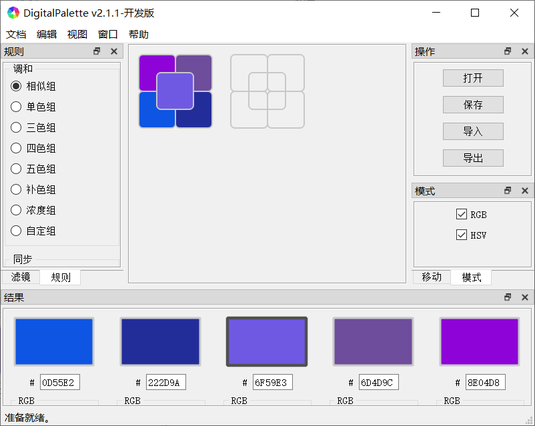

3. 将 Swatch File 文件导入至 Photoshop  
首先打开 Photoshop, 在色板选项卡中下拉菜单中选择"导入", 打开文件对话框.  
然后找到之前保存的色板文件, 点击打开即可. 配好的色彩即会追加至当前色板最后.  
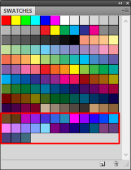

3. 导入 Swatch File 文件至优动漫 Paint  
首先打开优动漫 Paint, 在色板选项卡中下拉菜单中选择"载入色板", 打开文件对话框.  
然后找到之前保存的色板文件, 点击打开即可. 配好的色彩即会出现在一个单独的色板选项卡中.  
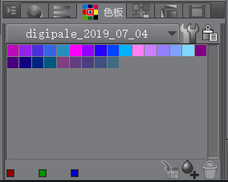

## 从图片中提取一组颜色
目前 DigitalPalette 暂不支持自动从图片中提取一组符合色彩调和规则颜色, 仅提供分析与提取工具.  

# 作者
Liu Jia

# 许可证
DigitalPalette 是自由软件，本着可用的意愿分发，但**不作任何担保**。您可以在遵守由自由软件基金会发布的 GNU 通用公共许可协议的情况下重新分发并且（或者）修改软件。更多细节请参看 GNU 通用公共许可协议。
