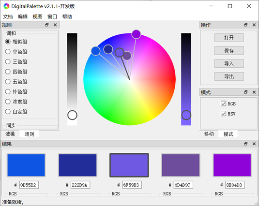
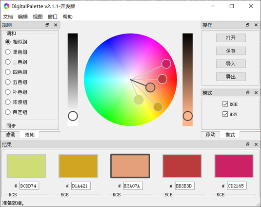
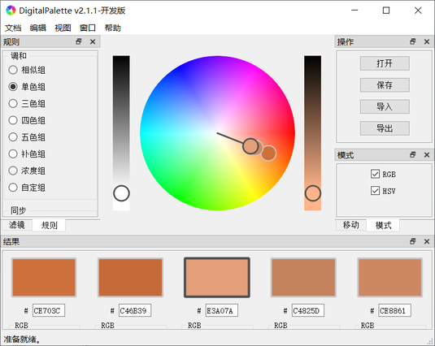
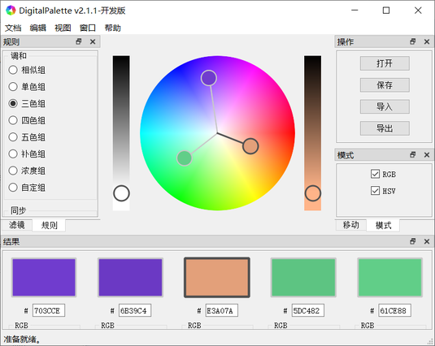
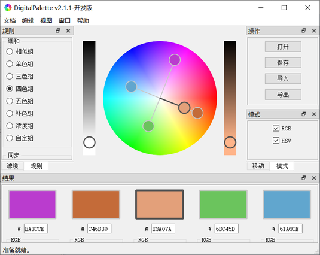
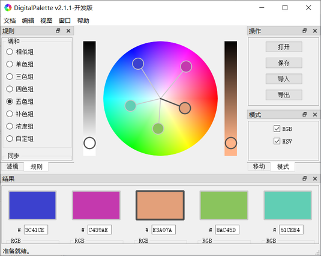
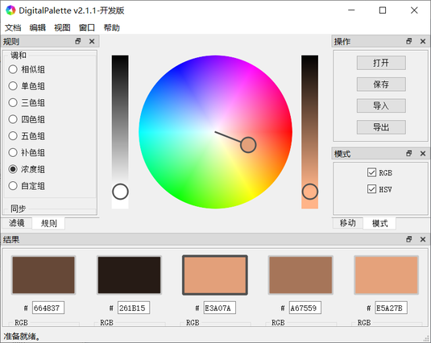
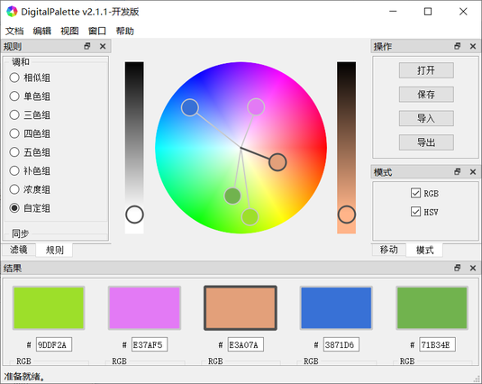
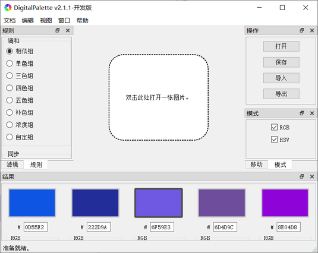

# DigitalPalette

DigitalPalette 是一款免费开源软件，您可以使用它从色彩转轮或者已有图像中生成一组符合一定调和规则的色彩，并将其应用到您的创作中。

# 版本
2.1.2（开发版）

# 安装方法
## 下载
[Windows（32 bit）安装程序（推荐）]()  
[Windows（64 bit）安装程序]()  
[Windows（32 bit）压缩包]()  
[Windows（64 bit）压缩包]()  

## 安装
1. 双击打开下载的安装程序，点击“**下一步**”。  

2. 阅读[许可协议](../LICENSE)。若您同意则勾选“**我接受许可协议**”，点击“**下一步**”。  

3. 选择安装路径，点击“**安装**”开始安装。  

4. 点击“**完成**”结束安装，运行 DigitalPalette。  

# 使用方法
## 更改语言
目前我们仅提供中文和英文界面的翻译。更改界面语言的方法如下：  
1. 点击**菜单栏**中的“**编辑**”，选择“**设置**”，打开设置对话框。
2. 在“**软件**”选项卡中点击“**语言**”旁的下拉菜单，选择目标语言，然后点击“**确定**”即可更改当前界面的语言。

## 界面布局
DigitalPalette 的界面布局包括：  
1. **标题栏**，包含软件名称（DigitalPalette）和当前版本（v2.1.1-开发版）。
2. **菜单栏**，包含“**文档**”、“**编辑**”、“**视图**”、“**窗口**”以及“**帮助**”选项。
3. **工作区域**，提供从色彩转轮中**创建**一组色彩、从色彩图像中**定位**一组色彩以及将创建的色彩**添加**到色彩仓库中等具体操作。
4. **规则窗口**，为色彩组设置调和规则和同步方式。
5. **滤镜窗口**，为打开的图像设置类目和通道。
6. **操作窗口**，操作文件和工作区域。
7. **模式窗口**，为色彩组结果设置显示模式。
8. **移动窗口**，移动和缩放图像和仓库内容。
9. **结果窗口**，显示和修改色彩组结果。

## 从色彩转轮中创建一组色彩
色彩转轮是**工作区域**的默认视图。若当前**工作区域**的视图不是色彩转轮，您可以通过单击**菜单栏**中的“**视图**”，然后选择“**转轮**”切换到色彩转轮视图。色彩转轮视图如下图所示。  
**工作区域**中的色彩转轮上有五个环形色彩标签，分别对应于**结果窗口**中的五个色彩方块（中间色彩方块的颜色决定着主色彩）。您可以通过拖动标签来改变对应的颜色，也可以通过调节**结果窗口**里的 RGB 或者 HSV 滑动条等方式来精准控制其颜色。与此同时, 色彩转轮上的其他标签的位置和颜色也将根据所选的色彩调和规则发生相应的变化。色彩调和规则可以在**规则窗口**中设置。  

### 色彩调和规则
1. **相似组**  
相似组是色彩调和的默认规则。您可以使用该规则创建一组色调等间距分布的色彩。其中标签间距越相近，色彩越类似。  

2. **单色组**  
您可以使用该规则创建一组相同色调，不同饱和度和明度的色彩。  

3. **三色组**  
您可以使用该规则创建一组色调三等分的色彩。  

4. **四色组**  
您可以使用该规则创建一组两两互补的色彩。  

5. **五色组**  
您可以使用该规则创建一组色调五等分的色彩。  

6. **补色组**  
您可以使用该规则创建一组互补的色彩。  

7. **浓度组**  
您可以使用该规则创建一组色调和饱和度相同，仅有明度变化的色彩。  

8. **自定组**  
您可以使用该规则创建一组色调、饱和度和明度任意变化的色彩。  

## 从色彩图片中定位一组色彩
若当前**工作区域**的视图不是色彩图像，您可以通过单击**菜单栏**中的“**视图**”，然后选择“**图像**”切换到色彩图像视图。色彩图像视图如下图所示。  
打开一张已有的色彩图像后，左键单击**工作区域**中图像上的任意位置，该位置将出现一个与**结果窗口**中色彩方块对应的色彩标签。其颜色也将改变为图像中对应点的颜色。同样地，您可以通过拖动该标签改变对应的颜色。与此同时, 色彩转轮上的其他标签也将根据色彩调和规则发生相应的变化。色彩调和规则可以在**规则窗口**中设置。  

## 将创建的色彩添加到色彩仓库中
若当前**工作区域**的视图不是色彩仓库，您可以通过单击**菜单栏**中的“**视图**”，然后选择“**仓库**”切换到色彩仓库视图。色彩仓库视图如下图所示。  
在色彩仓库中，您可以增加、删除、修改和查看保存的色彩组及其信息。色彩仓库中每个图标包含五个色彩方块，分别对应色彩组的五种颜色，其中正中间方块的颜色代表主色彩。  

## 打开和保存色彩仓库以及导入和导出色彩组
当您配好一组或者多组色彩后，您可以将仓库中所有的色彩组或者当前结果中的色彩组导出并保存为可读写文档或者其他格式文档, 以便后续的使用和分析。步骤如下：  
1. 点击**操作窗口**中的“**保存**”按钮, 在弹出的对话框中填写文件名和路径。点击“保存”即可导出仓库中所有的色彩组。
2. 点击**操作窗口**中的“**打开**”按钮, 在弹出的对话框中填写文件名和路径。点击“打开”即可导入文件中所有的色彩组。
3. 点击**操作窗口**中的“**导出**”按钮, 在弹出的对话框中填写文件名和路径。点击“保存”即可导出当前结果中的色彩组。
3. 点击**操作窗口**中的“**导入**”按钮, 在弹出的对话框中填写文件名和路径。点击“打开”即可导入文件中保存的色彩组。

### 文档格式
1. DigiPale Json 文档 (*.json)  
此格式文档中保存有所有的色彩数据，包括色彩的调和规则、色彩的十六进制（Hex）代码、RGB 数值、HSV 数值等。此格式文档可以作为备份使用并导入（恢复）到 DigitalPalette 中。

2. 纯文本文档 (*.txt)  
此格式文档中保存有基本的色彩数据，包括色彩的 Hex 代码、RGB 数值、HSV 数值等。此格式文档比 DigiPale Json 格式文档的可读性更好，可以直接用普通编辑器打开、阅览和编辑。

3. Adobe 样板文档 (*.aco)  
此格式文档中保存有所有的色彩数值，可作为色彩样板导入到 Photoshop、GIMP 等图像处理软件中。

## 快捷键
| 名称 | 说明 | 快捷键 |
| --- | --- | --- |
| **工作区域** | - | - |
| 打开 | 打开色彩仓库文档。 | Alt+O; Ctrl+O |
| 保存 | 保存色彩仓库文档。 | Alt+S; Ctrl+S |
| 导入 | 导入色彩组文档。 | Alt+I; Ctrl+I |
| 导出 | 导出色彩组文档。 | Alt+E; Ctrl+E |
| 设置 | 设置参数。 | Alt+T; ` |
| 退出 | 退出软件。 | Alt+Q; Esc |
| 创建 | 切换至色彩转轮视图或者（并且）从转轮中创建一组色彩。 | Alt+C; Ctrl+W |
| 定位 | 切换至色彩图像视图或者（并且）从图像中定位一组色彩。 | Alt+L; Ctrl+G |
| 添加 | 切换至色彩仓库视图或者（并且）将色彩组保存至仓库中。 | Alt+A; Ctrl+D |
| 主页 | 通过浏览器打开软件主页。 | Alt+H; F1 |
| 更新 | 通过浏览器寻找软件更新。 | Alt+U; F2 |
| 关于 | 显示与本软件相关的信息。 | Alt+B; F3 |
| **结果区域** | - | - |
| 复制标记的 RGB | 将色彩标签标记的 RGB 数值（单个）复制到系统剪贴板。 | R |
| 复制标记的 HSV | 将色彩标签标记的 HSV 数值（单个）复制到系统剪贴板。 | H |
| 复制标记的 Hex | 将色彩标签标记的 Hex 代码（单个）复制到系统剪贴板。 | X |
| 复制 RGB 结果 | 将结果中所有的 RGB 数值（五个）复制到系统剪贴板。 | Shift+R |
| 复制 HSV 结果 | 将结果中所有的 HSV 数值（五个）复制到系统剪贴板。 | Shift+H |
| 复制 Hex 结果 | 将结果中所有的 Hex 代码（五个）复制到系统剪贴板。 | Shift+X |
| 激活标签 | 激活色彩转轮中对应的色彩标签。 | 1; 2; 3; 4; 5 |
| **仓库区域** | - | - |
| 复制当前的 RGB | 将仓库中选中的 RGB 数值（五个）复制到系统剪贴板。 | Ctrl+R |
| 复制当前的 HSV | 将仓库中选中的 HSV 数值（五个）复制到系统剪贴板。 | Ctrl+H |
| 复制当前的 Hex | 将仓库中选中的 Hex 代码（五个）复制到系统剪贴板。 | Ctrl+X |
| 从仓库中删除 | 从仓库中删除选中的色彩组。 | Delete; D |
| 在仓库中插入 | 将结果区域的色彩组添加到仓库中或者将选中的色彩组导入到结果区域。 | Insert; I |
| **移动方式** | - | - |
| 平移 | 平移打开的图像。 | ↑; ↓; ←; → |
| 缩放 | 缩放打开的图像。 | =; -; [; ] |
| 重置 | 重置图像位置和大小。 | Home |

# 作者
刘佳

# 版权
版权 © 2019。版权所有。

# 许可证
DigitalPalette 是自由软件，本着可用的意愿分发，但**不作任何担保**。您可以在遵守由自由软件基金会发布的 GNU 通用公共许可协议的情况下重新分发并且（或者）修改软件。更多细节请参看 GNU 通用公共许可协议。
