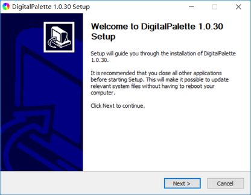
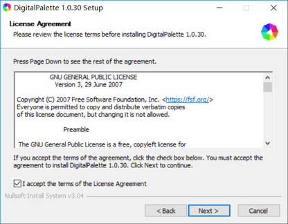
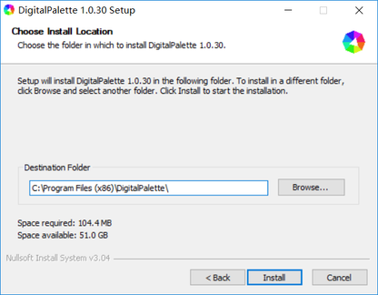
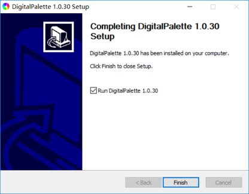
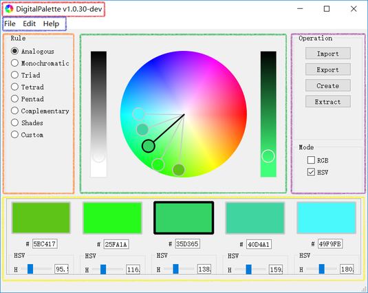
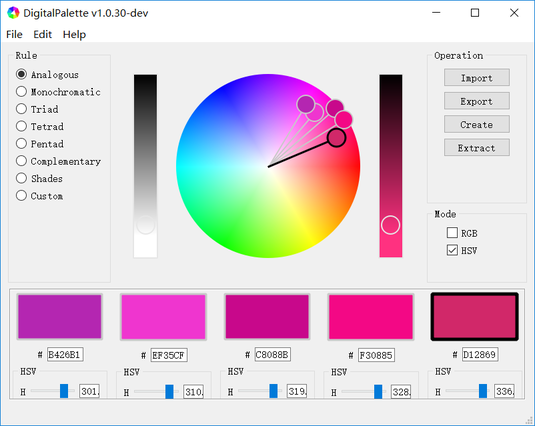
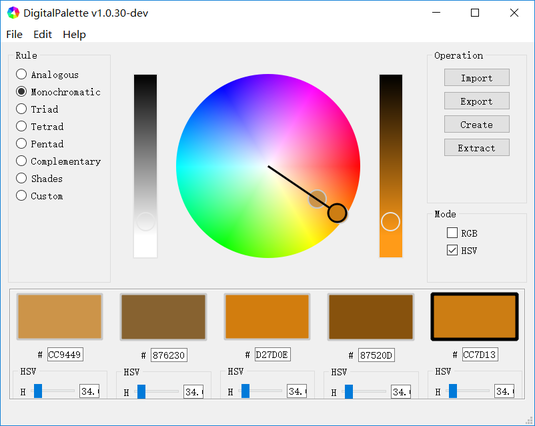
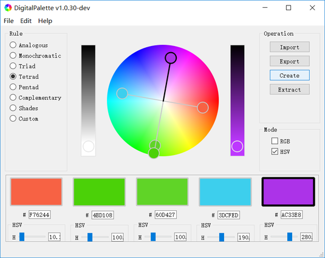
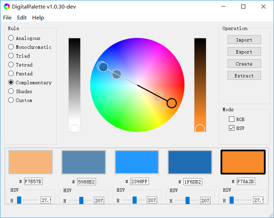
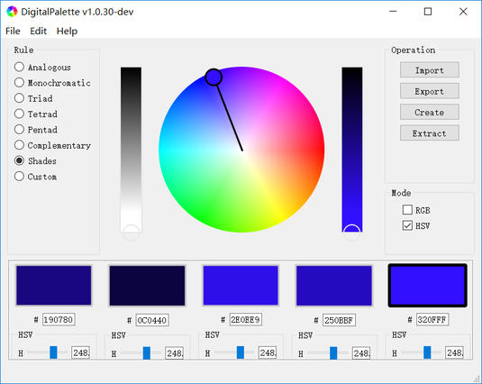

# DigitalPalette

DigitalPalette is a free software for generating harmonious colors from color wheel and local images.

# Version
1.0.30 (developing)

# Installation
## Download
[Windows (32 bit) Installer (Recommend)](Link)  
[Windows (64 bit) Installer](Link)  
[Windows (32 bit) Packet](Link)  
[Windows (64 bit) Packet](Link)  

## Install
1. Double click the installer and click "Next".  

2. Read the [License](../LICENSE). Check "I accept the terms of the License Aggrement" if you agree it, then click "Next".  

3. Choose an empty directory and click "Install" to start the installation.  

4. Click "Finish" to finish the installation and run DigitalPalette.  

# Usage
## Change the language
Currently we only provide English and Chinese translations. You could generate translation files by PyQt5 tools and put it into the language directory.  
...

## Interfacial Layout
The interfacial layout of DigitalPalette is displayed as bellow, where:  
* Title is surrounded by the red square, which indicates the name (DigitalPalette) and current version of this software.
* Menu bar is surrounded by the blue square, which includes the **import** (File -> Import) and **export** actions (File -> Export) of file, **Quit** action (File -> Quit), **create** (Edit -> Create) and **extract** (Edit -> Extract) actions of color set from color wheel and images as well as setup action of the prefer **settings** (Edit -> Settings) of this software, etc..
* Option bar is surrounded by the orange square, which includes a set of harmony rules.
* Tool bar is surrounded by the purple square, which include the common operations and color modes.
* Work area is surrounded by the green square.
* Result area is surrounded by the yellow square, which includes the color set informations such as the **hex** code, **RGB** values and **HSV** values of colors, etc..  

## Create colors from color wheel
The **color wheel** in the work area of DigitalPalette equips five circular **color tags**. These color tags are corresponding to the color squares in the result area. (The color of middle square determines the main hue of color set.) The color tag with black edge (labelled as "**activated color tag**") is corresponding to the currently selected color. You could change the colors by drag the color tags in wheel, or by double click the color squares, or through input the hex code and adjust the RGB and HSV value slides below the color squares. Meanwhile, other tags (labelled as "**inactivated color tag**") will move along with the activated color tag. The generating and moving methods of color tags are determined by the harmony rules, which will be demonstrate below.

## Harmony Rules
1. **Analogous** (default)
Create a set of colors with hue values in equidistant distributions. The closer of the tags, the more analogous of the colors.  

2. **Monochromatic**  
Create a set of colors with same hue and different saturation and lightness values.  

3. **Triad**  
Create a set of colors with hue values in trisection.  

4. **Tetrad**  
Create a set of colors with colors complementary to each other in pairs.  

5. **Pentad**  
Create a set of colors with hue values in quinquesection.  

6. **Complementary**  
Create a set of Complementary colors.  

7. **Shades**  
Create a set of colors with same hue and saturation values and different lightness values.  

8. **Custom**  
Create a set of colors in custom.  

## Export Colors
Harmonious colors can be exported to a readable and writable file by DigitalPalette for subsequent analysis and usage.  
...

## Data Formats
Currently DigitalPalette can format color data into file with following extensions:  
1. DigitalPalette Json File Format (*.json)  
...
2. Plain Text Format (*.txt)  
...
3. Swatch File Format (*.aco)  
...

## Import Colors (Swatches)
Currently DigitalPalette can import color data in DigitalPalette Json File Format. You could import color swatches into general image processing softwares, such as GIMP and Photoshop.  
...

## Extract Colors from an image
Currently DigitalPalette doesn't support to extract harmonious colors from an image automatically, and only provides tools for analysis and selections.  

# Author
Liu Jia

# License
DigitalPalette is a free software, which is distributed in the hope that it will be useful, but **without any warranty**. You can redistribute it and/or modify it under the terms of the GNU General Public License as published by the Free Software Foundation. See the GNU General Public License for more details.
