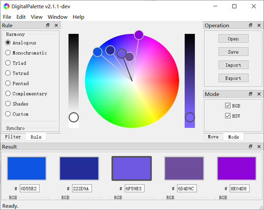
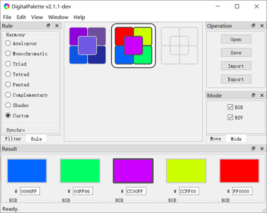

# DigitalPalette

DigitalPalette is a free software for generating a set of harmonious colors from color wheel or existed images and applying it into your creative works.

# Version
2.2.3 (develop)

# Installation
## Download
[Windows (32 bit) Installer (Recommend)]()  
[Windows (64 bit) Installer]()  
[Windows (32 bit) Packet]()  
[Windows (64 bit) Packet]()  

## Install
1. Double click the installer and click "**Next**".  

2. Read the [License](../LICENSE). Check "**I accept the terms of the License Aggrement**" if you agree with it, then click "**Next**".  

3. Choose a directory and click "**Install**" to start the installation.  

4. Click "**Finish**" to finish the installation and run DigitalPalette.  

# Usage
## Change the language
Currently we only provide English and Chinese interface translations. You could change the interface language through:  
1. Click "**Edit**" in the **menu bar** and select "**Settings**" to open the settings dialog.
2. Click the combo box lateral to "**Language**" label in "**Software**" tab. Select the target language and click "**OK**" to change the interface language.

## Interface Layout
The Interface layout of DigitalPalette includes:  
1. **Title bar**, which include the name of software (DigitalPalette and current version (v2.1.1-dev).
2. **Menu bar**, which include "**File**", "**Edit**", "**View**", "**Window**" and "**Help**" selections.
3. **Work area**, which provide actions such as **creating** a set of colors from color wheel, **locating** a set of colors from color image and **attaching** a set of colors into color depot.
4. **Rule window**, which set harmony rule and synchronization method for color set.
5. **Filter window**, which set category and channel for opened image.
6. **Operation window**, which manipulate files and work area.
7. **Mode window**, which set display mode for color set result.
8. **Move window**, which move and zoom image and depot content.
9. **Result window**, which display and modify color set result.

## Creating a set of colors from color wheel
Color wheel is the default view of **work area**. You could click "**View**" in the **menu bar** and select "**Wheel**" to switch into color wheel view if your current **work area** view isn't color wheel. The color wheel view is shown as below.  
There are five color tags in ring shape above the color wheel in work area, which corresponding to the five color squares in **result window** (where the central color square determins the major color). You could change the corresponding color by dragging the tag, or adjust the sliders of RGB or HSV in **result window** to control its color accurately. Meanwhile, the position and color of other tags on color wheel would also changed according to the selected harmony rule. The harmony rule could be settled in **rule window**.  

## Color Harmony Rules
1. **Analogous**
Analogous is the default rule. You could create a set of colors with hue values in equidistant distributions in this rule. Note that the closer the tags, the more analogous the colors.  

2. **Monochromatic**  
You could create a set of colors with same hue and different saturation and lightness values in this rule.  

3. **Triad**  
You could create a set of colors with hue values in trigonal distributions in this rule.  

4. **Tetrad**  
You could create a set of colors with colors complementary to each other in pairs in this rule.  

5. **Pentad**  
You could create a set of colors with hue values in pentagonal distributions in this rule.  

6. **Complementary**  
You could create a set of Complementary colors in this rule.  

7. **Shades**  
You could create a set of colors with same hue and saturation values and different lightness values in this rule.  

8. **Custom**  
You could create a set of colors in custom in this rule.  

## Locating a set of colors from color image
You could click "**View**" in the **menu bar** and select "**Graph**" to switch into color image view if your current **work area** view isn't color image. The color image view is shown as below.  
Left click anywhere above the image in **work area** after opening an existed image, and a color tag corresponding to the color square in **result window** would appeared at this position. Its color will also change into the corresponding color in image. Similarly, you could change the corresponding color by dragging the tag. Meanwhile, the position and color of other tags on color wheel would also changed according to the selected harmony rule. The harmony rule could be settled in **rule window**.  

## Attaching a set of colors into color depot
You could click "**View**" in the **menu bar** and select "**Depot**" to switch into color depot view if your current **work area** view isn't color depot. The color depot view is shown as below.  
You could add, delete, modify and check the stored color sets and their information in color depot. Each icon in color depot includes five color squares, which are corresponding to the five colors of color set. Note that the color of central square represents the major color.  

## Example
1. Switch **work area** into color image view and open the image below. This image could be found in samples folder under the install directory of DigitalPalette.  

2. The interface of DigitalPalette is shown as below after open an image.  

3. Change the harmony rule in **rule window** into "Custom" and click the third color square in **result window**, then click the center purple area in image. It could be seen that a color tag is appeared at where we clicked. Meanwhile, the color of the third color square has changed into purple. Similarly, we could settle the color of other color squares as the other colors in image.  

4. Switch **work area** into color depot view. The interface of DigitalPalette is shown as below.  

5. Double click the last empty color set icon and add the color set we located from image into color depot.  

6. Right click the added color set icon and click "Detail" and open the color set information dialog.  

7. We could check the colors and harmony rule of color set and modify the name and description of color set. It could be seen that the harmony rule of this color set is "Custom" and it is mainly composed of blue, green, purple, yellow and red, where purple is the major color. Click the editor beside "Name" and modify the name as "My first color set". Click the editor below "Description" and modify the description as "This is my first color set collected from a DigitalPalette image sample."  

8. Switch **work area** into color wheel view and check the distribution of each color in this color set. It could be seen that these colors are distribute in pentad shape, and the saturation and lightness of colors are extremely high.  

9. We could change the harmony rule into "Pentad" according to the distribution of colors as discussed above. Then we could drag the color tag and lower their saturation and lightness and get the other color set.  

10. Switch **work area** into color depot view and add this color set into color depot, check and modify the information of this color set in the same way.  

## Open and Save Color Depot and Import and Export Color Set
All color sets in depot or color set in current result could be exported and save as readable and writable files or other formated files for subsequent usage and analysis. Steps:  
1. Click the "**Save**" button in **operation window** and fill the file name and path in opened dialog. Click "Save" to export all color sets in depot.  

2. Click the "**Open**" button in **operation window** and fill the file name and path in opened dialog. Click "Open" to import all color sets in file.  

3. Click the "**Export**" button in **operation window** and fill the file name and path in opened dialog. Click "Save" to export the color set in current result.  

4. Click the "**Import**" button in **operation window** and fill the file name and path in opened dialog. Click "Open" to import the color set saved in file.  

### File Formats
1. DigiPale Json File (*.json)  
File in this format contains all color data, including the harmony rule, hex code, RGB and HSV values of colors. This type of file could be used as backups and can be imported (recovered) into DigitalPalette.

2. Plain Text File (*.txt)  
File in this format contains basic color data, including the hex code, RGB and HSV values of colors. This type of file has batter readability than DigiPale Json File and can be opened, readed and edited by ordinary editors directly.

3. Adobe Swatch File (*.aco)  
File in this format contains all color values and can be imported into image processing softwares such as Photoshop and GIMP as color swatches.

# Shortcuts
| Name | Description | Shortcut |
| --- | --- | --- |
| Work Area | # | # |
| Open | Open a color depot file. | Alt+O; Ctrl+O |
| Save | Save a color depot file. | Alt+S; Ctrl+S |
| Import | Import a color set file. | Alt+I; Ctrl+I |
| Export | Export a color set file. | Alt+E; Ctrl+E |
| Settings | Set settings. | Alt+T; ` |
| Quit | Quit software. | Alt+Q; Esc |
| Create | Switch into color wheel view or (and) create a set of colors from wheel. | Alt+C; Ctrl+W |
| Locate | Switch into color image view or (and) locate a set of colors from image. | Alt+L; Ctrl+G |
| Attach | Switch into color depot view or (and) attach a set of colors into depot. | Alt+A; Ctrl+D |
| Homepage | Open the homepage website through web browser. | Alt+H; F1 |
| Update | Search for software updates through web browser. | Alt+U; F2 |
| About | Display information relative to this software. | Alt+B; F3 |
| Result Area | # | # |
| Copy Tagged RGB | Copy the RGB value (single) tagged by color tag into system clipboard. | R |
| Copy Tagged HSV | Copy the HSV value (single) tagged by color tag into system clipboard. | H |
| Copy Tagged Hex | Copy the Hex code (single) tagged by color tag into system clipboard. | X |
| Copy RGB Result | Copy all RGB values (five) in result into system clipboard. | Shift+R |
| Copy HSV Result | Copy all HSV values (five) in result into system clipboard. | Shift+H |
| Copy Hex Result | Copy all RGB codes (five) in result into system clipboard. | Shift+X |
| Activate Tag | Activate the corresponding color tag in color wheel. | 1; 2; 3; 4; 5 |
| Depot Area | # | # |
| Copy Current RGB | Copy the RGB values (five) selected in depot into system clipboard. | Ctrl+R |
| Copy Current HSV | Copy the RGB values (five) selected in depot into system clipboard. | Ctrl+H |
| Copy Current Hex | Copy the RGB values (five) selected in depot into system clipboard. | Ctrl+X |
| Delete from Depot | Delete the selected color set from depot. | Delete; D |
| Insert into Depot | Attach the color set in result area into depot or import the selected color set into result area. | Insert; I |
| Move Actions | # | # |
| Move | Move the opened image. | ↑; ↓; ←; → |
| Zoom | Zoom the opened image. | =; -; [; ] |
| Reset | Reset the position and size of image. | Home |

# Author
Eigenmiao

# Copyright
Copyright © 2019-2020. All Rights Reserved.

# License
DigitalPalette is a free software, which is distributed in the hope that it will be useful, but **without any warranty**. You can redistribute it and/or modify it under the terms of the GNU General Public License as published by the Free Software Foundation. See the GNU General Public License for more details.
